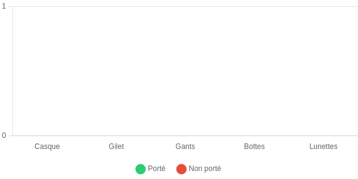

# SafeZone AI – Système de détection de sécurité en temps réel

## Aperçu du Projet

SafeZone AI est une solution innovante conçue pour améliorer la sécurité dans les environnements industriels, en particulier dans les entreprises spécialisées dans les produits chimiques. Ce système utilise l'intelligence artificielle pour la détection en temps réel des équipements de protection individuelle (EPI) et l'identification des personnes autorisées dans les zones sensibles. L'objectif principal est de prévenir les incidents en alertant immédiatement en cas de non-conformité ou d'intrusion non autorisée.

## Contexte Client

Le projet répond aux besoins d'une entreprise industrielle tunisienne cherchant à renforcer la sécurité sur ses sites. Les exigences clés incluent :

*   **Surveillance Automatique :** Utilisation des caméras de surveillance existantes pour une détection continue.
*   **Détection d'Anomalies :** Identification automatique de l'absence d'EPI (casque, gilet, lunettes) et des personnes non autorisées.
*   **Tableau de Bord Centralisé :** Un tableau de bord pour visualiser les alertes en temps réel, suivre les statistiques par jour et par zone.
*   **IA Locale :** Traitement de l'IA en local ou sur un serveur privé pour garantir une confidentialité élevée des données, sans recours à des services cloud externes.

## Fonctionnalités Clés

*   **Détection d'EPI :** Reconnaissance automatique du port de casque, gilet, et lunettes de sécurité.
*   **Reconnaissance Faciale :** Identification des personnes autorisées dans les zones restreintes.
*   **Système d'Alerte :** Génération d'alertes instantanées en cas d'infraction aux règles de sécurité ou d'accès non autorisé.
*   **Tableau de Bord Interactif :** Visualisation des données de sécurité, y compris le nombre d'alertes par jour, les vidéos des infractions, et la liste des personnes non reconnues.

## Architecture Technique

Le système SafeZone AI est structuré autour de plusieurs composants interconnectés, garantissant une performance robuste et une haute confidentialité.

### Partie IA

*   **Détection d'Équipements de Sécurité :** Utilisation de **YOLOv8** pour une détection rapide et précise des EPI.
*   **Reconnaissance Faciale :** Combinaison de **MTCNN** (Multi-task Cascaded Convolutional Networks) pour la détection des visages et **FaceNet** pour la génération d'embeddings faciaux et la reconnaissance.
*   **Base de Données des Visages :** Une base de données **SQLite** stocke les embeddings des visages des employés autorisés, permettant une vérification rapide et sécurisée.

### Backend

Le backend est développé avec **Flask**, un micro-framework Python, pour gérer la logique serveur et les interactions avec les modèles d'IA et la base de données.

*   **Flux Vidéo :** Utilisation de **Socket** ou **WebRTC** pour la transmission en temps réel des flux vidéo depuis les caméras de surveillance.
*   **API REST :** Une API RESTful est exposée pour permettre l'accès aux données d'alertes et aux statistiques, facilitant l'intégration avec d'autres systèmes ou applications.

### Frontend

Le tableau de bord interactif est construit avec **Streamlit** ou **Gradio** (dans cette implémentation, un frontend HTML/CSS/JS est utilisé pour le tableau de bord).

*   **Visualisation des Alertes :** Affichage du nombre d'alertes par jour, permettant un suivi rapide des incidents.
*   **Vidéos des Infractions :** Accès aux enregistrements vidéo des moments où les règles de sécurité ont été enfreintes.
*   **Liste des Personnes Non Reconnues :** Identification des individus non autorisés ayant accédé à des zones sensibles.

### Stockage

*   **Base de Données :** **SQLite** (ou PostgreSQL pour des déploiements plus importants) est utilisé pour stocker les visages encodés, les logs d'alertes et l'historique des vidéos (ou des liens vers des fichiers locaux).

## Pour aller plus loin

Des améliorations futures pourraient inclure l'intégration de systèmes d'alerte en temps réel via **Twilio** (pour les SMS/appels) ou un **Bot Telegram** pour une notification instantanée des incidents aux équipes de sécurité.

## Captures d'Écran du Tableau de Bord

Voici quelques aperçus du tableau de bord de SafeZone AI, illustrant les fonctionnalités de surveillance et de reporting.

### Vue d'ensemble



### Statistiques par Équipement


## Installation et Utilisation

### Prérequis

*   Python 3.x
*   pip (gestionnaire de paquets Python)
*   OpenCV (pour le traitement vidéo)

### Étapes d'Installation

1.  **Cloner le dépôt :**

    ```bash
    git clone https://github.com/votre_utilisateur/SafeZone-AI.git
    cd SafeZone-AI
    ```

2.  **Installer les dépendances Python :**

    ```bash
    pip install -r requirements.txt
    ```

3.  **Préparer les modèles d'IA :**

    Assurez-vous que le modèle YOLOv8 (`best.pt`) est placé dans le dossier `models/`.

4.  **Préparer la base de données des visages :**

    Placez les images des personnes autorisées dans le dossier `data/known_faces/`.

### Lancement de l'Application

1.  **Lancer le backend Flask :**

    ```bash
    python src/app.py
    ```

2.  **Accéder au tableau de bord :**

    Ouvrez votre navigateur et naviguez vers `http://localhost:5000/dashboard` pour le tableau de bord ou `http://localhost:5000/` pour le flux vidéo en direct (si la caméra est configurée).

## Structure du Projet

```
SafeZone-AI/
├── src/
│   ├── app.py              # Application Flask principale
│   ├── detect.py           # Logique de détection YOLOv8
│   ├── detect_face.py      # Détection et reconnaissance faciale
│   ├── detect_only_faces.py # Détection des visages uniquement
│   ├── face_db.py          # Gestion de la base de données des visages
│   ├── log.py              # Gestion des logs d'alertes
├── frontend/
│   ├── dashboard.html      # Template HTML du tableau de bord
│   ├── index.html          # Template HTML de la page d'accueil (flux vidéo)
│   ├── script.js           # Scripts JavaScript pour le frontend
│   ├── style.css           # Styles CSS pour le frontend
├── models/
│   ├── best.pt             # Modèle YOLOv8 entraîné
├── data/
│   ├── known_faces/        # Images des personnes autorisées
│   ├── log.csv             # Fichier de logs des alertes
├── notebooks/
│   ├── model.ipynb         # Notebook Jupyter pour l'entraînement/expérimentation des modèles
├── docs/
│   ├── images/             # Captures d'écran et autres images de documentation
├── requirements.txt        # Dépendances Python du projet
├── README.md               # Ce fichier
├── .gitignore              # Fichier pour ignorer les fichiers non nécessaires pour Git
```

## Contribution

Les contributions sont les bienvenues ! Veuillez suivre ces étapes :

1.  Fork le dépôt.
2.  Créez une nouvelle branche (`git checkout -b feature/nouvelle-fonctionnalite`).
3.  Effectuez vos modifications et commitez-les (`git commit -am 'Ajouter une nouvelle fonctionnalité'`).
4.  Poussez vers la branche (`git push origin feature/nouvelle-fonctionnalite`).
5.  Créez une Pull Request.

## Licence

Ce projet est sous licence MIT. Voir le fichier `LICENSE` pour plus de détails.

## Contact

Pour toute question ou suggestion, veuillez ouvrir une issue sur ce dépôt GitHub.


